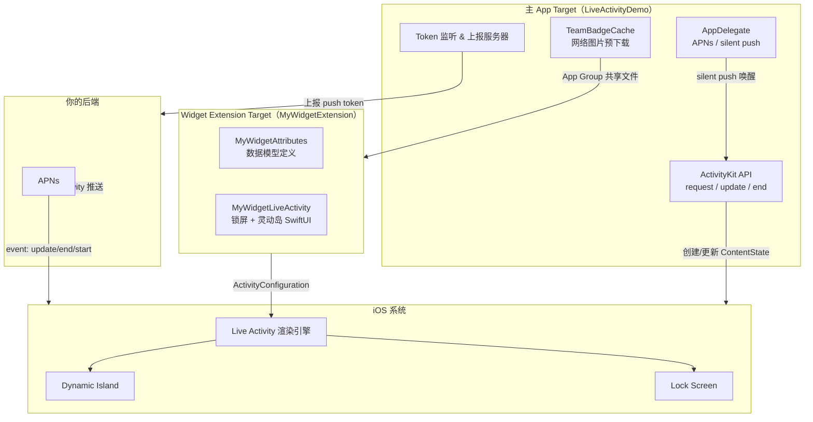
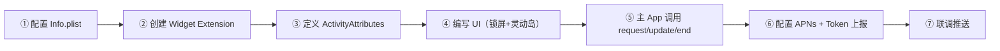
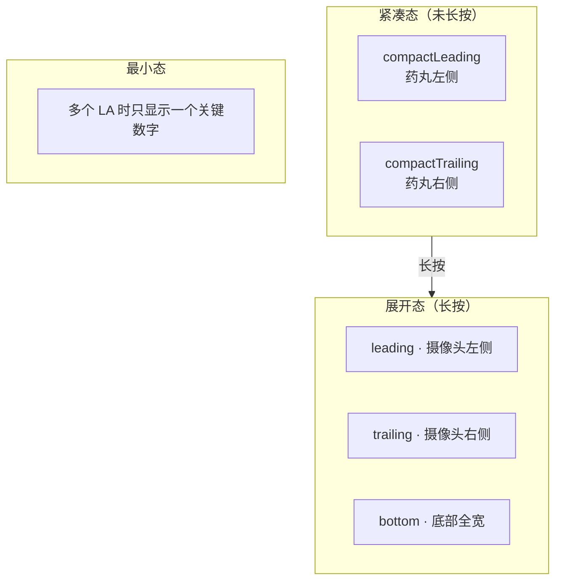
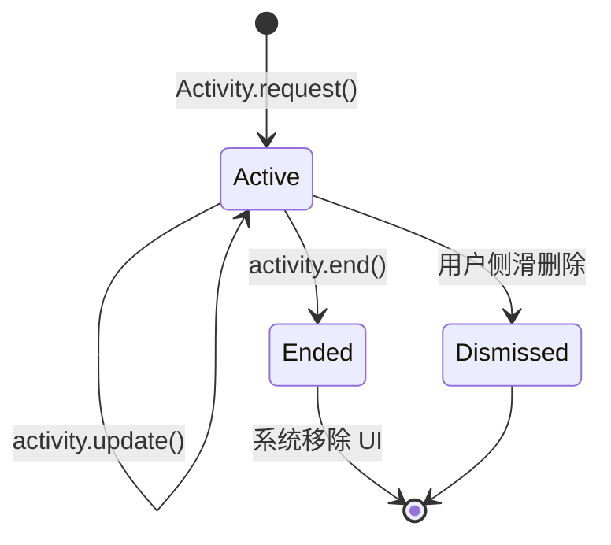
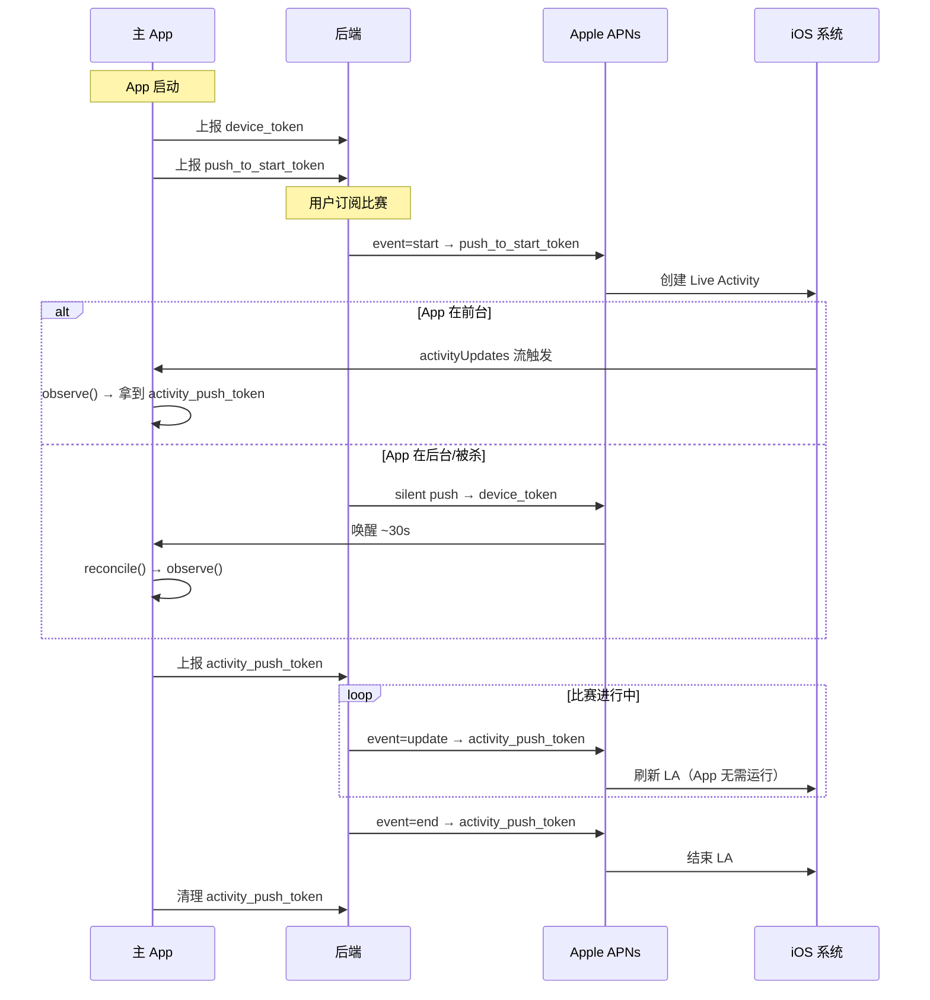
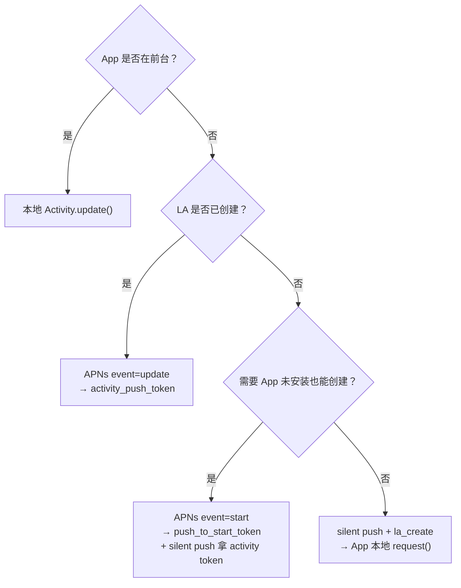

# iOS 实时活动（Live Activity）开发指南

> 基于 [LiveActivityDemo](https://github.com/aklee/LiveActivityDemo) 实战项目整理。目标：让第一次接触 Live Activity 的开发者，在半天内跑通「本地创建 → 远程推送更新 → 结束」的完整链路，并避开最常见的联调坑。

---

## 目录

1. [它是什么，适合做什么](#1-它是什么适合做什么)
2. [系统架构一图看懂](#2-系统架构一图看懂)
3. [限制与前置条件](#3-限制与前置条件)
4. [从零到跑通：开发流程](#4-从零到跑通开发流程)
5. [数据模型设计](#5-数据模型设计)
6. [UI 开发：锁屏 + 灵动岛](#6-ui-开发锁屏--灵动岛)
7. [本地生命周期管理](#7-本地生命周期管理)
8. [远程推送：三种 Token 与完整链路](#8-远程推送三种-token-与完整链路)
9. [APNs 推送格式与联调要点](#9-apns-推送格式与联调要点)
10. [本 Demo 的调试工具](#10-本-demo-的调试工具)
11. [踩坑清单（联调必读）](#11-踩坑清单联调必读)
12. [参考资料](#12-参考资料)

---

## 1. 它是什么，适合做什么

**Live Activity（实时活动，简称 LA）** 是 Apple 在 iOS 16.1 引入的系统级能力。它让 App 能在**锁屏**和**灵动岛（Dynamic Island）**上持续展示「正在进行中」的任务状态——外卖配送进度、比赛比分、打车 ETA 等。

和传统通知的区别：

| 维度 | 普通推送通知 | Live Activity |
|------|-------------|---------------|
| 展示时长 | 弹出后很快消失 | 最长在灵动岛保留 8 小时，锁屏最长 12 小时 |
| 信息密度 | 标题 + 正文 | 自定义 SwiftUI 布局，可展示结构化数据 |
| 更新方式 | 每次一条新通知 | 同一条活动原地刷新，系统做过渡动画 |
| 用户操作 | 点开进 App | 可点击灵动岛/锁屏卡片直接跳转 |

Apple 官方设计原则：**只展示最关键的信息，保持简洁**；更多细节留给用户点击后进入 App 查看。（参见 [Human Interface Guidelines - Live Activities](https://developer.apple.com/cn/design/human-interface-guidelines/live-activities/)）

本 Demo 以**足球比赛实时比分**为场景：主队/客队队徽、比分、比赛时钟、赛事标题，覆盖锁屏卡片和灵动岛三种形态（紧凑 / 展开 / 最小）。

---

## 2. 系统架构一图看懂

Live Activity 横跨两个 Target，理解这个分工是避免「改了代码但界面不变」的第一步。



**关键认知：**

- **ActivityKit 的调用代码**（启动、更新、结束）写在**主 App**里。
- **UI 代码**（`ActivityConfiguration`）写在 **Widget Extension**里，系统渲染时只加载扩展进程。
- Live Activity 虽然复用 WidgetKit，但**不是 Widget**：没有 Timeline，不走 `TimelineProvider`，而是靠 `Activity.update` 或 APNs 推送驱动刷新。
- Widget Extension **不能访问网络**；需要网络资源（如队徽图片）必须由主 App 预先下载到 **App Group** 共享目录。

---

## 3. 限制与前置条件

### 3.1 系统与设备

| 项目 | 说明 |
|------|------|
| 最低版本 | iOS 16.1（本地创建/更新）；iOS 17.2+ 支持 push-to-start（App 未运行也能创建） |
| 设备 | iPhone；灵动岛仅 iPhone 14 Pro 及以上「药丸屏」机型 |
| 证书 | 远程推送更新必须使用 **APNs Auth Key（.p8）**，不支持旧式 push 证书 |

### 3.2 运行时限制

| 限制 | 详情 |
|------|------|
| 数据大小 | 每次传给 LA 的 payload（本地或 APNs）不超过 **4KB** |
| 网络 | Extension 进程**不能**发网络请求 |
| 动画 | 开发者**不能**自定义过渡动画，由系统控制 |
| 并发数量 | 设备同时活跃的 LA 数量有限（系统决定，超额会创建失败） |
| 存活时长 | 灵动岛最多 **8 小时**；结束后锁屏最多再保留 **4 小时**（合计最长约 12 小时） |
| 启动时机 | **仅 App 在前台**时才能本地 `Activity.request`；前后台均可 update / end |

### 3.3 权限开关

```swift
// 检查用户是否允许 Live Activity
ActivityAuthorizationInfo().areActivitiesEnabled

// 监听权限变化
for await enabled in ActivityAuthorizationInfo().activityEnablementUpdates { ... }
```

用户可在 **设置 → 通知 → 你的 App → 实时活动** 中关闭。高频推送场景还需开启「更频繁的实时活动更新」，对应 Info.plist 的 `NSSupportsLiveActivitiesFrequentUpdates = YES`。

---

## 4. 从零到跑通：开发流程

下面是从零接入的完整 Checklist，按顺序做基本不会走弯路。



### 步骤 ①：主 App Info.plist 配置

```xml
<!-- 必须 -->
<key>NSSupportsLiveActivities</key>
<true/>

<!-- 需要高频推送更新时（如比赛时钟每分钟刷新） -->
<key>NSSupportsLiveActivitiesFrequentUpdates</key>
<true/>

<!-- 需要后台 silent push 唤醒时 -->
<key>UIBackgroundModes</key>
<array>
    <string>remote-notification</string>
</array>
```

### 步骤 ②：创建 Widget Extension

Xcode → File → New → Target → **Widget Extension**，勾选 **Include Live Activity**。

创建后你会得到：

- `MyWidgetBundle.swift` — 扩展入口，注册 Widget 和 Live Activity
- `MyWidgetLiveActivity.swift` — Live Activity UI 模板

确保 `MyWidgetAttributes` 类型对**主 App Target 和 Widget Extension Target 都可见**（本 Demo 将模型定义在 Extension 里，主 App import `MyWidgetExtension`）。

### 步骤 ③：配置 App Group（如需共享资源）

如果 LA 需要展示网络图片、共享缓存等：

1. Apple Developer 后台注册 App Group（如 `group.com.gate.liveactivitydemo`）
2. 主 App 和 Widget Extension 的 Signing & Capabilities 都勾选同一个 Group
3. 主 App 负责下载写入，Extension 只读

### 步骤 ④～⑦

见下文各章节。本 Demo 对应文件：

| 职责 | 文件 |
|------|------|
| 数据模型 + UI | `MyWidget/MyWidgetLiveActivity.swift` |
| 共享视图组件 | `LiveActivityDemo/ViewUtils.swift` |
| ActivityKit 调用收敛 | `LiveActivityDemo/LiveActivityUtils.swift` |
| App 启动 & 推送入口 | `LiveActivityDemo/LiveActivityDemoApp.swift` |
| 调试页面 | `LiveActivityDemo/Home.swift` |

---

## 5. 数据模型设计

所有 Live Activity 的数据模型都遵循 `ActivityAttributes` 协议，分为两层：

```swift
public struct MyWidgetAttributes: ActivityAttributes {

    // 可变状态：每次 update / APNs 推送都会更新这部分
    public struct ContentState: Codable, Hashable {
        public var homeScore: Int
        public var awayScore: Int
        public var minuteText: String      // 如 "75′"
        public var aggregateLine: String   // 如 "首回合 4-5"
    }

    // 固定属性：创建时写入，之后一般不变
    public var appName: String
    public var matchStageTitle: String
    public var homeTeamName: String
    public var awayTeamName: String
    public var homeTeamLogoURL: String   // 只传 URL 字符串，不传图片 Data
    public var awayTeamLogoURL: String
}
```

**设计原则：**

| 放哪里 | 放什么 | 原因 |
|--------|--------|------|
| `ContentState` | 比分、时钟、进度百分比等频繁变化的数据 | 推送 payload 的 `content-state` 只更新这部分 |
| `Attributes` | 队名、赛事标题、订单号等创建后不变的信息 | push-to-start 的 `attributes` 字段对应这里 |
| 不放 LA 里 | 图片二进制、大段文本 | 4KB 限制 + Extension 不能联网 |

`ContentState` 的字段名必须与 APNs payload 里 `content-state` 的 key **完全一致**（区分大小写），且类型要能被 JSON 正确反序列化。

---

## 6. UI 开发：锁屏 + 灵动岛

### 6.1 整体结构

```swift
ActivityConfiguration(for: MyWidgetAttributes.self) { context in
    // ① 锁屏 / 通知中心 的大卡片
    lockScreenView(context)

} dynamicIsland: { context in
    DynamicIsland {
        // ② 长按展开后的分区布局
        DynamicIslandExpandedRegion(.leading) { ... }
        DynamicIslandExpandedRegion(.trailing) { ... }
        DynamicIslandExpandedRegion(.bottom) { ... }
    } compactLeading: {
        // ③ 紧凑态 · 左侧
    } compactTrailing: {
        // ④ 紧凑态 · 右侧
    } minimal: {
        // ⑤ 多个 LA 共存时的最小态
    }
}
```

### 6.2 灵动岛五种形态



| 形态 | 典型用途 | Demo 示例 |
|------|----------|-----------|
| 锁屏卡片 | 信息最全 | 完整比分板：队徽 + 比分 + 时钟 + 赛事标题 |
| 展开态 | 长按后详情 | leading 放 App 名，trailing 放赛事标题，bottom 放比分 |
| 紧凑态 | 药丸常驻 | 左：主队徽+比分；右：比分+客队徽 |
| 最小态 | 多活动共存 | `2-1` |

### 6.3 UI 注意事项

1. **灵动岛背景恒为黑色**，建议对子视图强制 `.environment(\.colorScheme, .dark)`，避免浅色模式下白底白字。
2. **iOS 17+ 锁屏**必须加 `.containerBackground(for: .widget)`，否则控制台会持续报 `widget background view is missing`。
3. **不要放过多控件**，HIG 要求简洁；交互按钮优先用 App Intents（iOS 17+）。
4. **网络图片**：主 App 预下载到 App Group，Extension 用 `UIImage(contentsOfFile:)` 读取。
5. 点击跳转：`.widgetURL(URL(string: "yourscheme://path"))`，主 App 处理 URL Scheme。

---

## 7. 本地生命周期管理

本地模式适合 App 在前台、或不需要服务端推送的场景。三个核心 API：



### 7.1 创建（仅前台）

```swift
let activity = try Activity.request(
    attributes: attributes,
    contentState: initialState,
    pushType: .token   // 需要远程推送时必须传 .token
)
```

### 7.2 更新

```swift
// 静默更新（只刷新 UI）
await activity.update(using: newState, alertConfiguration: nil)

// 带横幅提醒（如进球）
let alert = AlertConfiguration(
    title: "比分更新",
    body: "1 - 0 · 45′",
    sound: .default
)
await activity.update(using: newState, alertConfiguration: alert)
```

### 7.3 结束

```swift
await activity.end(dismissalPolicy: .immediate)   // 立即消失
// 或 .default：保留最终状态一段时间后消失
```

### 7.4 本 Demo 的收敛设计

`LiveActivityUtils` 把所有 ActivityKit 调用集中管理，并维护「**同一时刻最多一个活跃 LA**」的不变量：

| 方法 | 调用时机 |
|------|----------|
| `observePushToStartTokens()` | App 启动，监听 push-to-start token 轮换 |
| `observeNewActivities()` | App 启动，监听系统新创建的 Activity |
| `reconcile()` | App 启动 / silent push 唤醒后，收敛到单个 active |
| `request()` | 用户点击「开启实时活动」 |
| `update()` | 本地刷新比分 |
| `end()` | 用户点击「结束」 |

**原则：用时打开，不用就关。** App 退出后若 LA 未正确结束，可能导致异常；业务结束时务必调用 `end()`。

---

## 8. 远程推送：三种 Token 与完整链路

远程推送是 Live Activity 最有价值的部分——**App 被杀掉后，服务端仍能刷新锁屏和灵动岛**。但这套链路比普适 APNs 复杂，核心原因是 Token 有三种，各司其职。

### 8.1 Token 三兄弟

| Token | 来源 | 长度（约） | 用途 |
|-------|------|-----------|------|
| `device_token` | `didRegisterForRemoteNotificationsWithDeviceToken` | 32 字节 hex | 发 **silent push** 唤醒 App |
| `push_to_start_token` | `Activity<>.pushToStartTokenUpdates`（iOS 17.2+） | 较长 | APNs `event: start`，**App 未运行也能创建 LA** |
| `activity_push_token` | `activity.pushTokenUpdates` | ~96 字节 hex | APNs `event: update` / `event: end`，操作已有 LA |

> 后两种 token 都会**定期轮换**，App 端必须循环监听并实时上报服务器。

### 8.2 完整生命周期



### 8.3 两种远程创建方案

| 方案 | 机制 | 优点 | 注意 |
|------|------|------|------|
| **A：push-to-start** | APNs `event: start` 直接创建 | App 完全不需要运行 | iOS 18 存在不分配 activity push token 的 bug；需再发 silent push 唤醒 App 拿 token |
| **B：silent push + 本地创建**（本 Demo 推荐） | silent push 携带 `la_create` payload → App 后台 `Activity.request` | 稳定拿到 activity push token | 需要 App 安装过且用户授权过通知；唤醒窗口约 30s |

方案 B 的 App 端入口：

```swift
func application(_ application: UIApplication,
                 didReceiveRemoteNotification userInfo: [AnyHashable: Any],
                 fetchCompletionHandler completionHandler: @escaping (UIBackgroundFetchResult) -> Void) {
    guard let payload = userInfo["la_create"] as? [String: Any] else {
        completionHandler(.noData)
        return
    }
    Task {
        await LiveActivityUtils.createFromSilentPush(payload)
        completionHandler(.newData)
    }
}
```

### 8.4 Token 上报时机（生产环境 checklist）

- [ ] App 启动 → 监听并上报 `push_to_start_token`
- [ ] 每次创建 LA → 监听 `pushTokenUpdates`，上报 `activity_push_token`
- [ ] Token 轮换时 → 重新上报（旧 token 会 410 失效）
- [ ] LA 结束（本地 end / 用户删除 / APNs end）→ 通知服务器清理 token
- [ ] 服务器收到 APNs 410 → 主动清理对应 token

---

## 9. APNs 推送格式与联调要点

### 9.1 请求头

| Header | Live Activity 推送 | Silent Push |
|--------|-------------------|-------------|
| `apns-push-type` | `liveactivity` | `background` |
| `apns-topic` | `<BundleID>.push-type.liveactivity` | `<BundleID>` |
| `apns-priority` | `10`（关键更新）/ `5`（静默 tick） | `5` |
| `authorization` | `bearer <JWT>` | 同左 |

> `apns-topic` 是最常见的联调错误：Live Activity 推送**不是**普通 Bundle ID，必须加 `.push-type.liveactivity` 后缀。

### 9.2 Payload 示例

**更新比分（event: update）：**

```json
{
  "aps": {
    "timestamp": 1719750000,
    "event": "update",
    "content-state": {
      "homeScore": 1,
      "awayScore": 0,
      "minuteText": "45′",
      "aggregateLine": "首回合 4-5"
    },
    "alert": {
      "title": "比分更新",
      "body": "1-0 · 45′"
    }
  }
}
```

**静默刷新时钟（无 alert，priority 5）：**

```json
{
  "aps": {
    "timestamp": 1719750060,
    "event": "update",
    "content-state": {
      "homeScore": 1,
      "awayScore": 0,
      "minuteText": "46′",
      "aggregateLine": "首回合 4-5"
    }
  }
}
```

**结束（event: end）：**

```json
{
  "aps": {
    "timestamp": 1719753600,
    "event": "end",
    "dismissal-date": 1719753660,
    "content-state": {
      "homeScore": 2,
      "awayScore": 1,
      "minuteText": "终场",
      "aggregateLine": "结束"
    }
  }
}
```

**关键字段说明：**

| 字段 | 必填 | 说明 |
|------|------|------|
| `timestamp` | 是 | **必须是当前 Unix 时间戳**，用旧值会推送失败 |
| `event` | 是 | `start` / `update` / `end` |
| `content-state` | update/end 必填 | key 必须与 `ContentState` 属性名一致 |
| `attributes` | start 必填 | 对应 `MyWidgetAttributes` 的固定字段 |
| `attributes-type` | start 必填 | 类型名，如 `MyWidgetAttributes` |
| `alert` | 否 | 有则触发横幅 + 声音 + 灵动岛短暂展开 |
| `dismissal-date` | end 时建议 | 锁屏消失时间（Unix 秒） |

### 9.3 环境匹配

| App 安装方式 | APNs Host |
|-------------|-----------|
| Xcode 直接安装（Debug） | `api.development.push.apple.com` |
| TestFlight / App Store | `api.push.apple.com` |

Debug 包装的开发 token 打到生产环境会返回 `400 BadDeviceToken`，反之亦然。

### 9.4 常见 HTTP 响应码

| 状态码 | 原因 | 处理 |
|--------|------|------|
| 200 | 成功 | — |
| 400 `BadDeviceToken` | token 错误或环境不匹配 | 重新拿 token；检查 development/production |
| 400 `TopicDisallowed` | apns-topic 错误 | 确认 `.push-type.liveactivity` 后缀 |
| 403 `InvalidProviderToken` | JWT 签名错误 | 检查 TEAM_ID / KEY_ID / .p8 文件 |
| 410 `Unregistered` | token 已失效 | 重启 App 拿新 token；服务器清理旧记录 |

---

## 10. 本 Demo 的调试工具

项目 `demo-tools/` 目录提供两套独立可用的联调工具，避免每次手动拼 curl。

### 10.1 方式一：后端 Dashboard（推荐）

```bash
cd demo-tools/server
./run.sh
# 浏览器打开 http://<Mac局域网IP>:8000
```

流程：

```
打开 App（真机）→ token 自动出现在 Dashboard
→ 点 [start] 创建 LA
→ 输入比分点 [update] 刷新
→ 点 [end] 结束
```

真机调试时把 `Info.plist` 的 `LADemoServerBaseURL` 改成 Mac 局域网 IP。

### 10.2 方式二：push.sh（轻量无服务器）

```bash
# 一次性配置 .p8 证书和 TEAM_ID / KEY_ID / BUNDLE_ID

# 方案 B：silent push 创建（推荐）
./push.sh <device-token> silent-create 0 0 "0′"

# 更新比分
./push.sh <activity-push-token> update 1 0 "45′"

# 静默时钟刷新
./push.sh <activity-push-token> tick 1 0 "46′"

# 结束
./push.sh <activity-push-token> end
```

### 10.3 日志过滤

```bash
idevicesyslog | grep -E "LiveActivityDemo|MyWidgetExtension"
```

关键日志：

| 日志 | 含义 |
|------|------|
| `push-to-start token:` | push-to-start token 刷新 |
| `activity push token` | 拿到 activity push token，可以 update/end 了 |
| `reconcile: N activities found` | 收敛检查 |
| `sync activity → 200` | token 上报服务器成功 |

---

## 11. 踩坑清单（联调必读）

### 开发阶段

| 问题 | 原因 | 解决 |
|------|------|------|
| 创建失败无 UI | 用户关闭了实时活动权限 | 检查 `areActivitiesEnabled`；引导用户去设置开启 |
| `request` 报错 | App 不在前台 | 确保在前台调用；远程创建走 push-to-start 或 silent push |
| 改了 UI 没变化 | 改的是主 App 代码 | UI 必须在 Widget Extension 里改 |
| 锁屏背景警告 | 缺少 containerBackground | iOS 17+ 加 `.containerBackground(for: .widget)` |
| 队徽显示空白 | Extension 不能联网 | 主 App 预下载到 App Group；push-to-start 创建时 App 没运行则首次可能空白，发 update 或打开 App 后恢复 |

### 推送联调

| 问题 | 原因 | 解决 |
|------|------|------|
| 200 但手机无反应 | 用了过期的 activity_push_token | token 轮换后必须重新上报；从日志/Dashboard 确认最新 token |
| start 后无法 update | 没拿到 activity_push_token | App 被杀时需等 silent push 唤醒（~30s）；检查 `observeNewActivities` 是否在启动时调用 |
| `TopicDisallowed` | apns-topic 写错 | 必须是 `com.xxx.app.push-type.liveactivity` |
| `BadDeviceToken` | 开发/生产环境不匹配 | 对照安装方式和 APNS_HOST |
| 更新很慢 | 未开启高频更新 | Info.plist 设 `NSSupportsLiveActivitiesFrequentUpdates`；用户设置里开启 |
| timestamp 推送失败 | 用了旧时间戳 | 每次请求用 `date +%s` 生成当前值 |

### 架构建议

1. **集中管理**：把 `request/update/end` 和 token 监听收敛到一个 Utils 类，避免散落在各处。
2. **幂等监听**：`pushTokenUpdates` 和 `activityStateUpdates` 用 Set 去重，防止 `reconcile` 重复挂 Task。
3. **Token 同步读 + 流**：`observe` 时先读 `activity.pushToken` 保底，再订阅 `pushTokenUpdates` 处理轮换。
4. **结束即清理**：无论本地 end、用户删除还是推送 end，都要通知服务器清 token。
5. **单活动约束**：业务上同时只展示一场比赛时，多余 active 应主动 end，避免占满系统配额。

---

## 12. 参考资料

### 官方文档

- [Displaying live data with Live Activities](https://developer.apple.com/documentation/activitykit/displaying-live-data-with-live-activities) — ActivityKit 官方接入指南
- [Starting and updating Live Activities with push notifications](https://developer.apple.com/documentation/activitykit/starting-and-updating-live-activities-with-activitykit-push-notifications) — 推送更新官方文档
- [WWDC23 - 了解 ActivityKit](https://developer.apple.com/cn/videos/play/wwdc2023/10184/) — 入门视频
- [WWDC23 - 使用推送通知来更新实时活动](https://developer.apple.com/cn/videos/play/wwdc2023/10185/) — 推送专题
- [Human Interface Guidelines - Live Activities](https://developer.apple.com/cn/design/human-interface-guidelines/live-activities/) — 设计规范

### 社区文章

- [掘金 - Live Activity 开发实战](https://juejin.cn/post/7400945359193047052) — 灵动岛 UI 布局详解（本 Demo 原作者文章）
- [腾讯云 IM - 实现 LiveActivity 功能](https://cloud.tencent.com/document/product/269/117738) — 结合 IM SDK 的接入示例
- [AppCoda - 如何在 SwiftUI App 中开发 Live Activities](https://www.appcoda.com.tw/live-activities/) — 从零搭建 Water Tracker 教程
- [OneSignal - Live Activities 开发者设置](https://documentation.onesignal.com/docs/cn/live-activities-developer-setup) — 第三方推送平台接入参考

### 本项目

- 源码：[LiveActivityDemo](https://github.com/aklee/LiveActivityDemo)
- 调试工具说明：[demo-tools/README.md](../demo-tools/README.md)
- 项目内 README：[README.md](../README.md)

---

## 附录：快速决策树

「我该用哪种方式更新 Live Activity？」



---

*文档版本：2026-06，基于 LiveActivityDemo 项目实践整理。*
